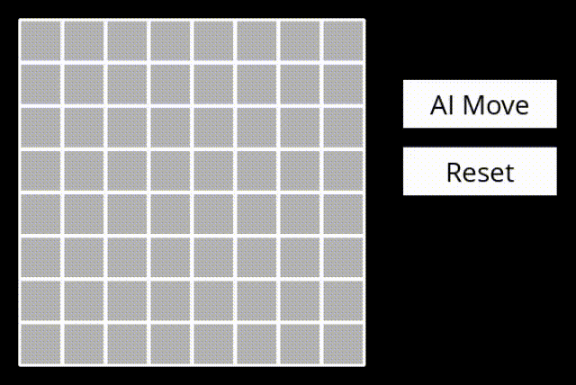
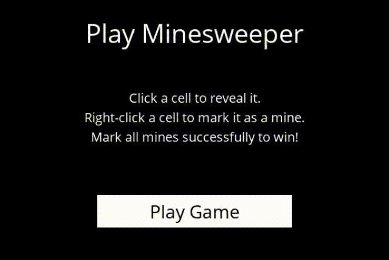

# <h1 align='center'>:video_game: Minesweeper :video_game:</h1>

<p align='center'> Using knowledge to solve the minesweeper game.</p>
<p align='center'> </p>

## Context

The idea of  this project is to use a knowledge based agent to perform *inteligent* steps to solve the minesweeper puzzle game. 

The main concept used to engineer the knowledge under the hood is the **propositional logic**. For more background regarding the problem or the concept, you can refer to the original page of the [CS50ai Project](https://cs50.harvard.edu/ai/2020/projects/1/minesweeper/).

## Concepts

### Knowledge

The main idea is that, whenever someone click on a safe cell in the game, you gain some **knowledge** regarding how many mines are there nearby.

So if cells are represented as `(i,j)` points in space
```
 _______ _______ _______ _______
| (0,0) | (0,1) | (0,2) | (0,3) | 
| (1,0) | (1,1) | (1,2) | (1,3) |
| (2,0) | (2,1) | (2,2) | (2,3) |
| (3,0) | (3,1) | (3,2) | (3,3) |
 ‾‾‾‾‾‾‾ ‾‾‾‾‾‾‾ ‾‾‾‾‾‾‾ ‾‾‾‾‾‾‾
```
If one clicks cell `(0,0)` and it the number 2 appears, 

```
 _______ _______ _______ _______
|   2   |       |       |       | 
|       |       |       |       |
|       |       |       |       |
|       |       |       |       |
 ‾‾‾‾‾‾‾ ‾‾‾‾‾‾‾ ‾‾‾‾‾‾‾ ‾‾‾‾‾‾‾
```

We can represent that piece of knowledge as  
```python
{(0,1), (1,0), (1,1)} = 2
```
To express the fact that there are `exactly` 2 mines within the set of cells `(0,1), (1,0) and (1,1)`

In python language, we can express it as a class. The `Sentence` class is used to represent that kind of knowledge. 
```python
class Sentence:
    def __init__(self, cells, count):
        self.cells = cells # {(0,1),(1,0),(1,1)}
        self.count = count # 2
```
### Identifying safe spots and mines

We can use the above knowledge to identify whenever a cell is surely a mine or a safe spot.
For instance, if the above example had the count of 3, 
```
 _______ _______ _______ _______
|   3   |       |       |       | 
|       |       |       |       |
|       |       |       |       |
|       |       |       |       |
 ‾‾‾‾‾‾‾ ‾‾‾‾‾‾‾ ‾‾‾‾‾‾‾ ‾‾‾‾‾‾‾
```
we can be certain that all nearby cells are mines.

Alternatively, if the above example had the count of 0,
```
 _______ _______ _______ _______
|   0   |       |       |       | 
|       |       |       |       |
|       |       |       |       |
|       |       |       |       |
 ‾‾‾‾‾‾‾ ‾‾‾‾‾‾‾ ‾‾‾‾‾‾‾ ‾‾‾‾‾‾‾
```
we could be certain that all nearby cells were safe spots.

### Inference

The most interesting steps, however, comes from when the computer can gather all the knowledge obtained and effectively infer new pieces of information (or knowledge). 
For instance, if we have a knowledge of the fact that 
```python
{(0,1), (1,1), (1,0)} = 2
```
And we suddenly gain a knowledge that 
```python
{(0,1)} = 1
```
We can infer that 
```python
{(1,1), (1,0)} = 1
```


## Results and discussions

### Solution
After implementing this algorithm, the *ai* is able to generate good solutions for a minesweeper puzzle. An interesting way to visualize the results is by coloring, for each step, the knowledge acquired, the cells the *ai* knows for sure is safe and the cells that it knows for sure it is a mine. Some of the moves are really non-intuitive (for me at least) at first sight.

For the following visualization, consider:
- **GREEN**: certainly safe cell
- **RED**: certainly mine
- **PURPLE**: field of vision (all knowledge sentences until the present moment, read more below) 

<p align='center'> </p>

### Making guesses
Another interesting aspect is the fact that the agent not always has the possibility to be 100% confident in every play. There may be a case where there are no safe spots known and the agent has to **guess**.
This guess can be fully random, but we can try to make an `educated guess`.
The `make_educated_guess` function was implemented to acknowledge the fact that in situations where you have the following knowledges:
```python
{A, B, C} = 1
```
and 
```python
{D, E} = 1
```  
if we were to guess, we could gather within our knowledge the guess which leads to the minimum probability of finding a mine. In this case, the first set of cells would lead to 1/3 (33%) probability whereas the second one would lead to 1/2 (50%) probability. So, A or B or C would be a wiser decision as compared to D or E.

In practice, though, this by itself sometimes is actually a blunder. This comes from the fact that all the knowledge that we have from the board comes from the places where we know there might be a **mine**. And sometimes the probability of guessing a random number and finding a mine across the whole board would be even smaller.

In the case below, for example, the agent chose to consider one of the cells from its known knowledge that would lead to 1 mine within 5 possible cells (20% probability).
<p align='center'> </p>

However, a random choice within the full board would lead to:
- 63 possible cells
- 8 bombs
- 8/63 ~ 12% probability

This, of course, supposes that we know in advance the total number of mines in the game. For simplicity, the current implementation considers that the number of MINES is the square root of the size of the board (which may not always be true).

### Field of vision
An interesting aspect of the knowledge based agent here is the fact that it uses pieces of knowledge gathered from previous steps. This is interesting because the piece of knowledge that the *ai* effectively *knows* acts like a field of vision, which is always fairly close to the boundaries of the cells the *ai* have tried. 
The knowledge representation is concerned with how many **mines** are there **nearby**. This implies that the method acts like an advancing frontier method, or a search algorithm, in a way.

This gets clearer for a minesweeper greater board solution. 

<p align='center'> </p>

### Logging
`TODO`

## Acknowledgements
`TODO`